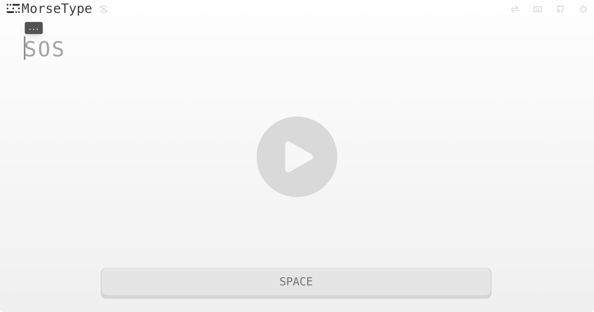
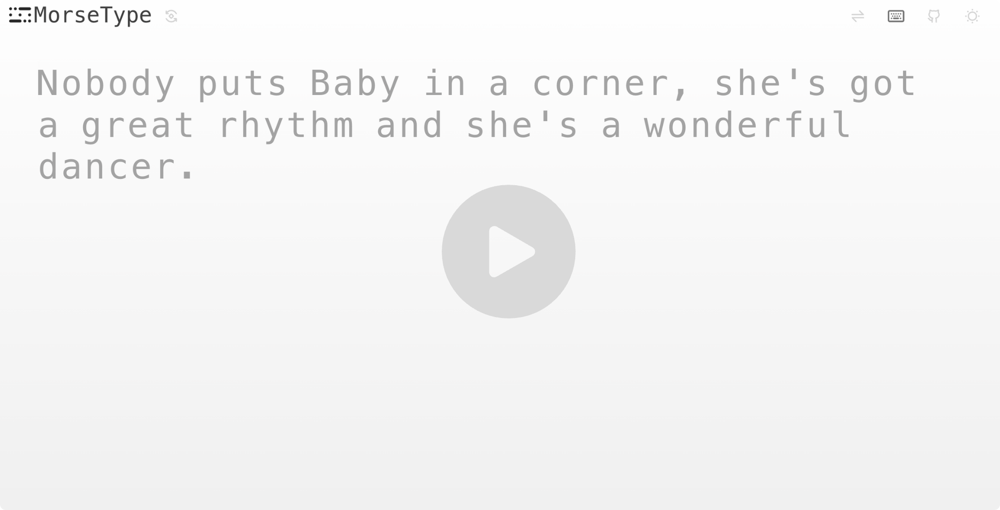
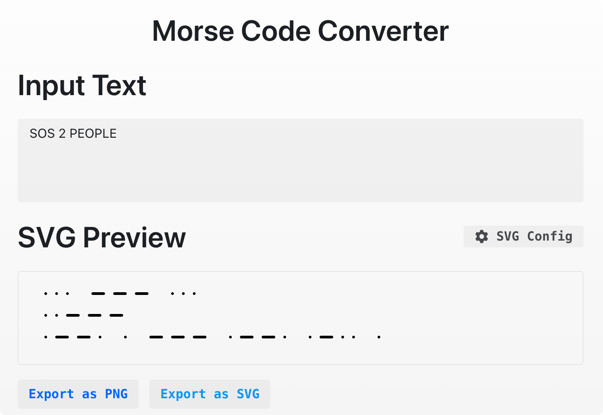

# 摩尔斯密码小玩具 🎯

一个有趣的摩尔斯密码学习和练习工具，让你轻松掌握这门古老而神秘的通信艺术！

## ✨ 功能

### 🎮 摩尔斯码输入练习
- **空格键操作**：短按产生"点"(·)，长按产生"划"(-)
- **实时反馈**：输入时会播放对应的音频提示
- **练习句子**：内置多个经典摩尔斯码练习句子，如"SOS"、"HELLO WORLD"等
- **视觉提示**：当前字符的摩尔斯码会以动画形式显示在屏幕上

### ⌨️ 英文字符练习
- **键盘输入**：直接使用键盘输入字符进行练习
- **错误提示**：输入错误时会有音效和视觉反馈
- **多样句子**：包含经典电影台词等有趣的练习内容

### 🔄 摩尔斯转换器
- **双向转换**：支持普通文本转摩尔斯码
- **SVG可视化**：将摩尔斯码以美观的线条形式展示
- **导出功能**：可将摩尔斯码图形导出为PNG或SVG格式
- **自定义样式**：可调整线条粗细、间距等视觉参数

## 🤝 贡献

欢迎提交 Issue 和 Pull Request 来改进这个项目！
